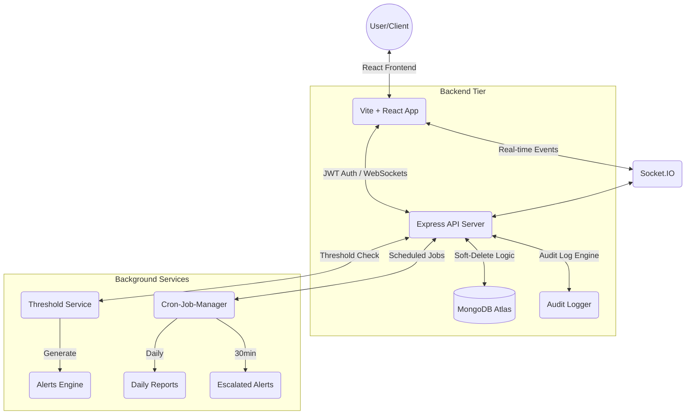

# Technology Stack & Development Workflow

This document provides the justification for the selected technology stack and outlines the development methodology used for the Sustainable Resource Monitor (EcoMonitor) project.

---

## 🏗️ Technology Stack Justification (MERN)

The **MERN Stack** (MongoDB, Express, React, Node.js) was selected for this project based on several critical requirements for a resource monitoring system:

| Layer | Technology | Justification |
|-------|------------|---------------|
| **Frontend** | **React** | Highly responsive UI with component-based architecture. Perfect for real-time dashboards where multiple charts/meters need to refresh independently (e.g., via WebSockets). |
| **Backend** | **Node.js & Express** | Event-driven, non-blocking I/O which is ideal for handling concurrent data ingestion from various resource monitors and managing WebSocket connections (Socket.io). |
| **Database** | **MongoDB** | A NoSQL document database allows for highly flexible schemas. This is crucial for resource monitoring where different resources (Electricity vs. Food Waste) have different data attributes and logging frequencies. |
| **Language** | **JavaScript/TS** | Using a single language across the entire stack streamlines development, reduces context switching, and allows for shared validation logic (e.g., resource types, roles) between client and server. |

---

## 📈 System Flow Diagram

---

## 🔄 GitHub Branching Strategy

The project follows a **Feature Branching Model** to ensure code stability and production readiness:

1. **`main` Branch**: Production-ready code. Only merged from `develop` after passing all 8/8 QA validation tests. Marked with release tags (e.g., `v1.0.0`).
2. **`develop` Branch**: Main integration branch. Contains the latest stable features.
3. **`feature/branch-name`**: Individual features (e.g., `feature/dean-dashboard`, `feature/pdf-export`) are developed here and merged into `develop` via Pull Requests.
4. **`fix/issue-name`**: Short-lived branches for patching bugs discovered during testing.
5. **`hotfix/issue-name`**: Critical production fixes that branch directly from `main` and are merged back to both `main` and `develop`.

---

## 🎨 UI/UX Theme & User Journey

### Color Palette
- **Primary**: Indigo/Blue (`#4F46E5`) for trust and professionalism.
- **Success**: Emerald/Green (`#10B981`) for efficient resource usage and "Resolved" status.
- **Warning**: Amber/Orange (`#F59E0B`) for threshold warnings and "Investigating" status.
- **Danger**: Rose/Red (`#EF4444`) for critical breaches and "Open" alerts.
- **Neutral**: Slate Grays for layout and secondary information.

### User Journey Example: Warden Alert Management
1. **Entry**: Warden logs in and lands on a block-specific Dashboard.
2. **Discovery**: Dashboard displays an "Active Alert" badge (Real-time via WebSocket).
3. **Investigation**: Warden clicks the badge → Alerts List → View Details.
4. **Action**: Warden assigns status "Investigating" and adds investigation notes.
5. **Resolution**: Once fixed, Warden marks as "Resolved" → Audit log recorded → Dashboard KPI updates instantly.

---

## 🔐 Security Standards
- **Authentication**: JWT-based stateless auth with token blacklisting.
- **Authorization**: Granular Role-Based Access Control (RBAC) at both route and controller levels.
- **Defense**: Helmet.js for secure headers, Express-Rate-Limit for DDoS prevention, and input sanitization via Express-Validator.
